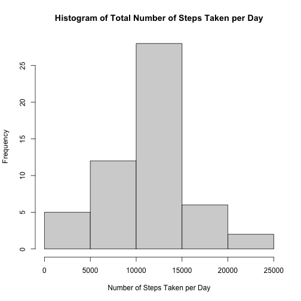
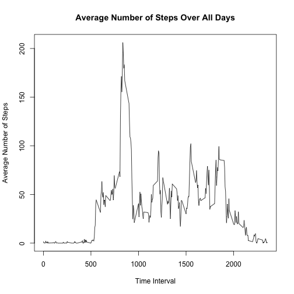

## Loading and preprocessing the data

Loading the data into a specified variable called data.

```r
data<-read.csv(unz("activity.zip","activity.csv"))
```
The summary of the data to give an idea how to process the data.

```r
summary(data)
```

```
##      steps            date              interval     
##  Min.   :  0.00   Length:17568       Min.   :   0.0  
##  1st Qu.:  0.00   Class :character   1st Qu.: 588.8  
##  Median :  0.00   Mode  :character   Median :1177.5  
##  Mean   : 37.38                      Mean   :1177.5  
##  3rd Qu.: 12.00                      3rd Qu.:1766.2  
##  Max.   :806.00                      Max.   :2355.0  
##  NA's   :2304
```
The fisrst six rows of the data.

```r
head(data)
```

```
##   steps       date interval
## 1    NA 2012-10-01        0
## 2    NA 2012-10-01        5
## 3    NA 2012-10-01       10
## 4    NA 2012-10-01       15
## 5    NA 2012-10-01       20
## 6    NA 2012-10-01       25
```
Removing the NA rows from the data

```r
data<-subset(data,!(is.na(data$steps)))
head(data)
```

```
##     steps       date interval
## 289     0 2012-10-02        0
## 290     0 2012-10-02        5
## 291     0 2012-10-02       10
## 292     0 2012-10-02       15
## 293     0 2012-10-02       20
## 294     0 2012-10-02       25
```
## What is mean total number of steps taken per day?

The data will be sorted according to day to calculate the numnber of steps taken per day using the dplyr package

```r
library("dplyr")
```

```
## 
## Attaching package: 'dplyr'
```

```
## The following objects are masked from 'package:stats':
## 
##     filter, lag
```

```
## The following objects are masked from 'package:base':
## 
##     intersect, setdiff, setequal, union
```

```r
day<-group_by(data,date)
daysteps<-summarise(day,total=sum(steps))
```

```
## `summarise()` ungrouping output (override with `.groups` argument)
```

```r
print(daysteps)
```

```
## # A tibble: 53 x 2
##    date       total
##    <chr>      <int>
##  1 2012-10-02   126
##  2 2012-10-03 11352
##  3 2012-10-04 12116
##  4 2012-10-05 13294
##  5 2012-10-06 15420
##  6 2012-10-07 11015
##  7 2012-10-09 12811
##  8 2012-10-10  9900
##  9 2012-10-11 10304
## 10 2012-10-12 17382
## # … with 43 more rows
```
Making a histogram from the processed data above

```r
hist(daysteps$total,main = "Histogram of Total Number of Steps Taken per Day", xlab ="Number of Steps Taken per Day" )
```


The mean and median of the total number of steps taken per day can be calculated by using the summary function on the processed data called "daysteps".

```r
summary(daysteps)
```

```
##      date               total      
##  Length:53          Min.   :   41  
##  Class :character   1st Qu.: 8841  
##  Mode  :character   Median :10765  
##                     Mean   :10766  
##                     3rd Qu.:13294  
##                     Max.   :21194
```
**Mean: 10766**  
**Median: 10765**

## What is the average daily activity pattern?
Making a line plot for average number of steps taken, averaged across all days versus 5-minute interval


```r
interval<-group_by(data,interval)
intervalstep<- summarise(interval, mean = mean(steps))
```

```
## `summarise()` ungrouping output (override with `.groups` argument)
```

```r
intervalstep
```

```
## # A tibble: 288 x 2
##    interval   mean
##       <int>  <dbl>
##  1        0 1.72  
##  2        5 0.340 
##  3       10 0.132 
##  4       15 0.151 
##  5       20 0.0755
##  6       25 2.09  
##  7       30 0.528 
##  8       35 0.868 
##  9       40 0     
## 10       45 1.47  
## # … with 278 more rows
```

```r
plot(intervalstep$interval,intervalstep$mean,type = 'l', main = "Average Number of Steps Over All Days", xlab = "Time Interval",ylab = "Average Number of Steps")
```


  
Finding the interval which the maximum number of steps occurs

```r
intervalstep[which.max(intervalstep$mean),]
```

```
## # A tibble: 1 x 2
##   interval  mean
##      <int> <dbl>
## 1      835  206.
```

## Imputing missing values
Calculating the total number of missing values in dataset

```r
raw_data<-read.csv(unz("activity.zip","activity.csv"))
sum(is.na(raw_data))
```

```
## [1] 2304
```

The missing data will be filled with values from Average Number of Steps Over All Days for the specified interval

```r
for(i in 1:nrow(raw_data)){
         if(is.na(raw_data$steps[i])){
                  inter<-subset(intervalstep,intervalstep$interval==raw_data$interval[i])
                  raw_data$steps[i]<-inter[1,2]
         }
}
```
Below is the first 6 rows of the new filled dataset

```r
head(raw_data)
```

```
##       steps       date interval
## 1  1.716981 2012-10-01        0
## 2 0.3396226 2012-10-01        5
## 3 0.1320755 2012-10-01       10
## 4 0.1509434 2012-10-01       15
## 5 0.0754717 2012-10-01       20
## 6   2.09434 2012-10-01       25
```

Histogram for total number of steps taken each day

```r
raw_data$steps<-as.numeric(raw_data$steps)
newday<-group_by(raw_data,date)
newdaysteps<-summarise(newday,total=sum(steps))
```

```
## `summarise()` ungrouping output (override with `.groups` argument)
```

```r
hist(newdaysteps$total,main = "Histogram of Total Number of Steps Taken per Day", xlab ="Number of Steps Taken per Day" )
```


  
Calculating the mean and median of the total number of steps taken per day

```r
summary(newdaysteps)
```

```
##      date               total      
##  Length:61          Min.   :   41  
##  Class :character   1st Qu.: 9819  
##  Mode  :character   Median :10766  
##                     Mean   :10766  
##                     3rd Qu.:12811  
##                     Max.   :21194
```
**Mean: 10766**  
**Median: 10766**  
The values from both variable are almost the same with negligible deviation. The calculation of the mean and median become more reliable since more data points are used in the calculation.  


## Are there differences in activity patterns between weekdays and weekends?
  
The class for date column is changed to Date using the as.Date() function. Then, a new column is added to identify the day of the date. Finally, using the day column created, the data is classified into 2 levels using the factor function.

```r
raw_data$date<-as.Date(raw_data$date)
class(raw_data$date)
```

```
## [1] "Date"
```

```r
raw_data<-mutate(raw_data,day=weekdays(date))
for(j in 1:nrow(raw_data)){
         if(raw_data$day[j]=='Monday'|raw_data$day[j]=='Tuesday'|raw_data$day[j]=='Wednesday'|raw_data$day[j]=='Thrusday'|raw_data$day[j]=='Friday'){
                  raw_data$day[j]<-"weekday"
         }
         else{
                  raw_data$day[j]<-"weekend"
         }
}
raw_data$day<-factor(raw_data$day)
levels(raw_data$day)
```

```
## [1] "weekday" "weekend"
```
  
Plotting the graph for each category

```r
newintervalstep<- aggregate(steps ~ interval + day, raw_data, mean)
library("ggplot2")
qplot(interval, steps, data = newintervalstep,  type = 'l', geom=c("line"), xlab = "Interval", ylab = "Number of steps") + facet_wrap(~ day, ncol = 1)
```

```
## Warning: Ignoring unknown parameters: type
```


### Complete
